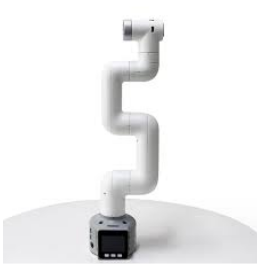
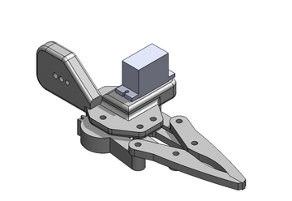
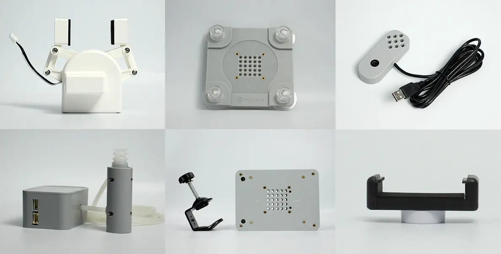

# Pick and Place Automation Using Cobot Arm with Vision-Based Color Detection

## Internship Overview

This project focuses on designing and implementing a **vision-based pick-and-place system** using a **Collaborative Robot Arm (Cobot Arm 280)**.

The system autonomously identifies colored objects using a camera and places them into their respective **color-coded baskets**.

<p align="center">
  
</p>
---

## Project Aim

To develop an automated pick-and-place solution where the cobot arm:

* Detects objects based on **color**
* Picks them using a **gripper mechanism**
* Places them accurately into corresponding **color baskets**

---

## Technical Objectives & Learning Outcomes

During this project, you will gain hands-on experience in:

* Industrial and Collaborative Robotics
* Robot Arm Kinematics & Motion Planning
* Vision-Based Automation using OpenCV
* Hardware–Software Integration

---

## Software Requirement

To enable communication with the Cobot Arm 280, you need to install the required Python library:

```bash
pip install pymycobot --upgrade
```

---

## Project Deliverables

By the end of the project, you are expected to successfully demonstrate the following:

### 1️Pick and Place Using Cobot Arm 280

* Accurate movement between pick and place locations
* Smooth and repeatable operation

### System Demonstration



### 2️Camera Integration

* Mounting and calibration of camera for object detection
* Capturing real-time video frames for processing

### 3️Robot Fixing & Setup

* Mechanical fixing and workspace setup of the cobot arm
* Ensuring safety and stability


### 4️Gripper Control

* Opening and closing of the gripper
* Synchronization of gripper action with arm movement

### System Demonstration





### 5️Computer Vision with OpenCV

* Color detection using HSV / RGB color space
* Object segmentation and contour detection
* Determining object position for robotic picking

---

## System Workflow

```text
Camera Capture → Color Detection → Object Localization →
Pick Command → Gripper Actuation → Place Command
```

---

## Technologies Used

* Cobot Arm 280
* Camera Module
* OpenCV
* Python
* Robot Control Interface

---

## Expected Outcome

A fully functional **vision-guided pick-and-place system** capable of:

* Identifying colored objects
* Picking them precisely
* Sorting them into respective color baskets

---

## Future Scope

* Shape-based sorting
* AI-based object classification
* Conveyor belt integration
* ROS-based automation

---

## Author

Pulkit Garg
Robotics Facilitator | Autonomous Systems Enthusiast
